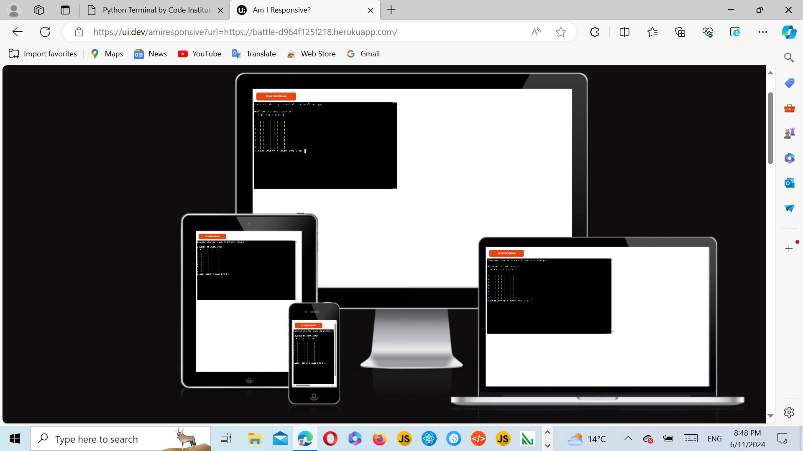
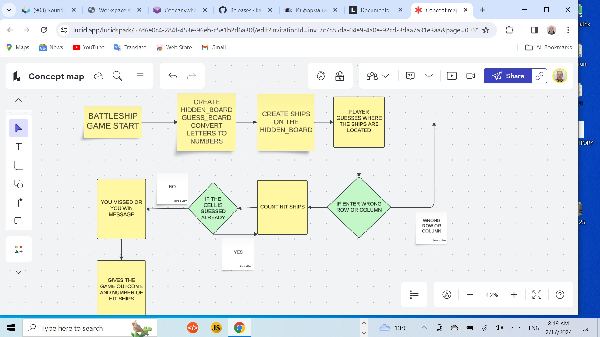
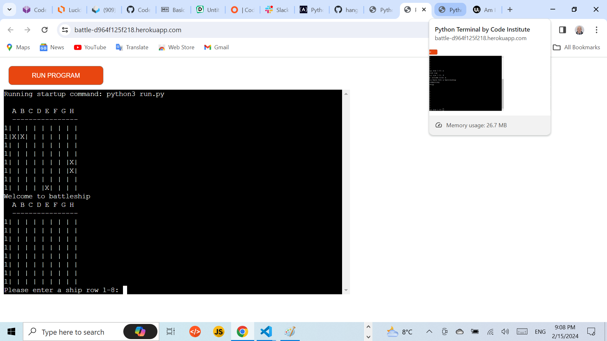
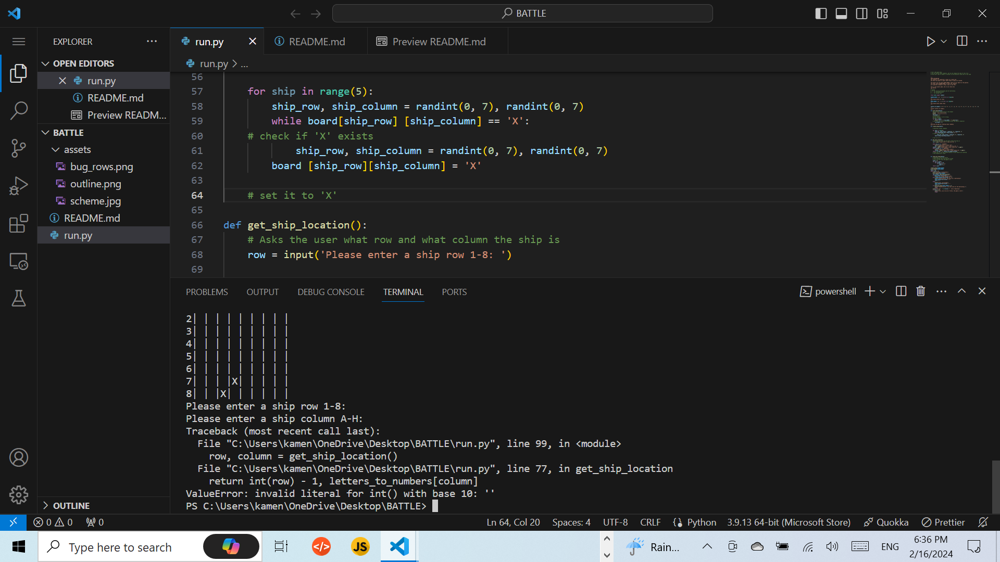

# GAME EXPLANATION

The computer will generate 5 ships on a board and 
then the player will guess where those 5 ships are located.

The player has one board GUESS_BOARD, where he will make his guesses. 
The hit ship will be marked with X on the GUESS_BOARD (Player's board).
The miss will be marked with hifen -

The other board HIDDEN_BOARD is where the computer 
will generate randomly 5 ships, each in one cell.

This is a one player game.

Please click on the link below to open the application.

 

 ### Welcome to the Battleship game! [Battleship](https://battle-d964f125f218.herokuapp.com/)

## FEATURES

This is one player game, and it has only
two boards.

This application is for entertainment.

The only language that was used is Python3.

This is a Command Line Application.

 The application is dynamic and is deployed on HEROKU server.

 GitHub was used to store the project's code, after being pushed
 from Git.

 Git was used by utilizing the Gitpod terminal to commit to Git and push to GitHub.

 ### Flow chart to work out the logic path the program needs to take 

 

 ### Bugs

 The application had one bug. Namely the row iteration was not working. Instead of showing 1,2,3,4,5,6,7,8 it showed only 1,1,1,1,1,1,1,1.
 By clearing an empty space the bug was resolved.

 

 This game was taken from youtube channel of Knowledge Mavens.
 There is a bug in this code, which appears if the player does not put anything for row or column.
 In that case the program crashes.

 

 If tha player hits enter without typing anything the program crashes. I tried to resolved by
 using 
 Try:
Except KeyValue:
Probably it could work, but I couldn't make it. I solved this problem by adding some code.

This is in the section, function get_ship_location. Namely within the while loop which loops as many times as the user puts wrong letters or numbers, the program promts the user to enter valid number and figure. However if the user presses enter without entering anything the program crashes. 

The code is as follows:  
    while row not in '12345678':
        print("Please enter a valid row")
        row = input('Please enter a ship row 1-8: ')
    crashes when the gamer just preses enter.

    My contribution is modifying the code as follows.
    while row not in '12345678' or row in " " :
        print("Please enter a valid row")
        row = input('Please enter a ship row 1-8: ')

        Adding 
        or row in " ":
    This prevents the program from crashing.

## Testing

The testing was made on Code Institute CI Python Linter.

## Deployment

The Visual Studio Code was used to create this application.

git add . was  used to add the files to the staging area

git commit -m "Commit message"
This command was used to commit changes to the local repository queue
ready for the final step

git push - This command was used to push all the committed code to the remote repository
on git hub

The game was deployed on the Heroku platform, thus making it accessible to the users.

## Forking on GitHub

- To create a personal copy of a public repository to contribute to a project
    
    Go to GitHub repositoryto fork

    Make changes to the code, add features, fix issues or modify code within your fork, 
    make changes that dont affect the original repository. If you want to send your changes
    back to the owner, you can do so by creating a "Pull Request".

## Credits

Special thanks to my mentor Medale Oluwafemi for helping me creating this README.md filey

