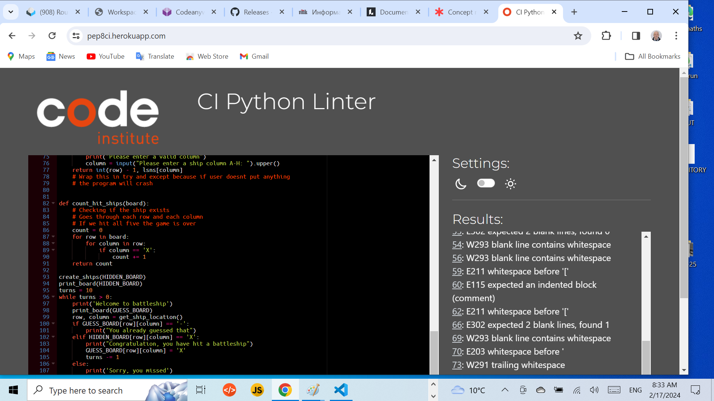

### Introduction (Game Explanation)

This is one player game, and it has only
two boards. The computer generates five ships on the HIDDEN_BOARD
and the player guesses ships location on the GUESS_BOARD. Each ships takes 
only one cell. Only the GUESS_BOARD is visible to the player. After ten
turns the game is over.

The player has one board GUESS_BOARD, where he will make his guesses. 
The hit ship will be marked with X on the GUESS_BOARD (Player's board).
The miss will be marked with hifen -
The other board HIDDEN_BOARD is where the computer 
will generate randomly 5 ships, each in one cell.

This is a one player game.

Screenshot for responsive design.

 

 ### Welcome to the Battleship game!

 Please click on the link below to open the application.
 
 [Battleship](https://battle-d964f125f218.herokuapp.com/)

### Features

This application is for entertainment.

 + The program accepts user inputs, maintains scores, validates the inputs.
 + Coordinates outside of the board can not be entered.
 + Player must enter row number and column letter.

### Future Features

 + Have ships larger than one cell
 + Allow player to select the board size, number of ships and ship sizes.

 ### Flow chart to work out the logic path the program needs to take 

 

 ### Bugs

 The application had one bug. Namely the row iteration was not working. Instead of showing 1,2,3,4,5,6,7,8 it showed only 1,1,1,1,1,1,1,1.
 By clearing an empty space the bug was resolved.

 

 This game was taken from youtube channel of Knowledge Mavens.
 There is a bug in this code, which appears if the player does not put anything for row or column.
 In that case the program crashes.

 

 If tha player hits enter without typing anything the program crashes. I tried to resolved by
 using 
 Try:
Except KeyValue:
Probably it could work, but I couldn't make it. I solved this problem by adding some code.

This is in the section, function get_ship_location. Namely within the while loop which loops as many times as the user puts wrong letters or numbers, the program promts the user to enter valid number and letter. However if the user presses enter without entering anything the program crashes. 

The code is as follows:  
    while row not in '12345678':
        print("Please enter a valid row")
        row = input('Please enter a ship row 1-8: ')
    crashes when the gamer just preses enter.

    My contribution is modifying the code as follows.
    while row not in '12345678' or row in " " :
        print("Please enter a valid row")
        row = input('Please enter a ship row 1-8: ')

        Adding 
        or row in " ":
    This prevents the program from crashing.

## Testing

The testing was made on Code Institute CI Python Linter.

There was an issue that showed that line No. was exceeding 82 chracters. letters_to_numbers was changed to lsln and the problem was solved.
There are numerous other errors like 

    **trailing whitespace** - there is a whitespace between the end of a line and the new line
    **whitespace before'** - indentation or leading whitespace
    **expected two blank lines found 0**
These errors I plan to fix on a later stage as at present I don't have good acces to HEROKU by codeanywhere.

### Programs and software used for creating this project

The language that was used is Python3 and Git Bash, Visual Studio Code.
Git Bash is an application that interfaces with the operating system
through written commands.

This is a Command Line Application.

 This application is dynamic and is deployed on HEROKU server.

 GitHub was used to store the project's code, after being pushed
 from Git.

 Git was used by utilizing the Gitpod terminal to commit to Git and push to GitHub.

 Several python functions were used:

  + print_board
  + create_ships
  + get_ship_location
  + count_hit_ships
    + while loop is used in the function for validation

## Deployment

The Visual Studio Code was used to create this application.

git add . was  used to add the files to the staging area

  git commit -m "Commit message"
This command was used to commit changes to the local repository queue
ready for the final step

  git push - This command was used to push all the committed code to the remote repository
on git hub

The game was deployed on the Heroku platform, thus making it accessible to the users.

First the application was deployed by codeanywhere.com, and after that I was unable to
make additional changes and to reach my deployed application using codeanywhere anymore. The additional
changes like fixing the bugs, making additional commits and creating this file README.md were made 
from my local repository, which was cloned from GitHub, to my desktop and using Visual Studio Code and the Command Line Interface (CLI), Git Bash commands namely 

      git remote add heroku https://git.heroku.com/app.git
      git push heroku master
      
This happens only after login from Git Bash
   
      `heroku login`

which displayed the CLI authentication token.
For this to happen HEROKU CLI had to be installed and then upgraded to to version 8.9.0
namely by using
      sudo apt -get update && sudo apt -get update heroku

## Forking on GitHub

- To create a personal copy of a public repository to contribute to a project go to GitHub repository to fork.

    Make changes to the code, add features, fix issues or modify code within your fork, 
    make changes that dont affect the original repository. If you want to send your changes
    back to the owner, you can do so by creating a "Pull Request".

## Credits

Special thanks to my mentor Medale Oluwafemi for helping me creating this README.md file, to Marco from the techical issues,and cohort facilitator Laura from Codeinstitute.

